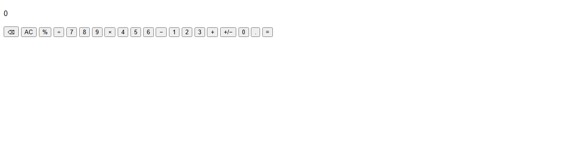
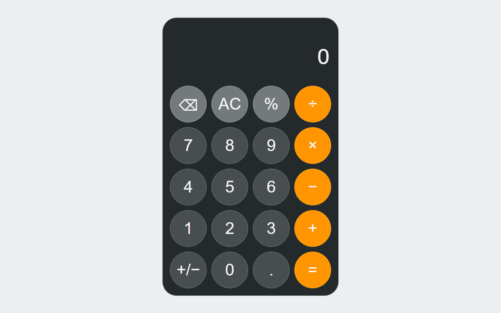
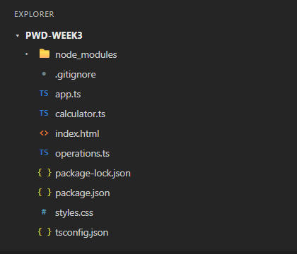

다른 사람이 코드를 실행하고 구조를 이해할 수 있도록 프로젝트 사용법과 실습 관찰 결과 기록하기.

프로젝트 폴더에 README.md를 만들기. 이미 이 안내 문서가 있다면 그대로 두고 자신의 실습 결과를 아래에 추가하기.
계산기 소개, 실행 명령(npm install, npm run build, index.html 열기), Step 7에서 확인한 결과와 해당 동작을 담당한 파일·함수를 기록하기.
저장하기.

---

# 3주차 · 나의 계산기

TypeScript로 작성한 웹 계산기. 사칙연산과 백분율·부호 반전·한 글자 지우기·전체 초기화를 지원하고, 0으로 나누기처럼 계산할 수 없는 입력은 화면에 오류 메시지로 표시.

- 배포 주소: https://azlsh-web.github.io/pwd-week3/
- 저장소: https://github.com/azlsh-web/pwd-week3

소스는 역할에 따라 세 파일로 나눠져 있음. `operations.ts`는 계산만 하고, `calculator.ts`는 상태만 다루며, `app.ts`만 DOM을 건드림.

## 실행 방법

```bash
npm install
npm run check
npm run build
```

- `npm install` : TypeScript 설치 (최초 1회)
- `npm run check` : 타입 검사만 수행, 파일 생성 없음
- `npm run build` : `.ts`를 `js/` 폴더에 JavaScript로 생성

빌드가 끝나면 `index.html`을 브라우저로 열기. `index.html`이 읽는 것은 `.ts`가 아니라 `js/` 안의 `.js`이므로, 코드를 고친 뒤에는 저장 → `npm run build` → 브라우저 새로고침 순서를 지켜야 화면에 반영됨.

## 파일 구조

| 파일 | 역할 |
| --- | --- |
| `index.html` | 화면 구조. 버튼마다 `data-key`로 입력값을 붙여 둠 |
| `styles.css` | 계산기 모양 (4열 그리드, 원형 버튼) |
| `operations.ts` | 사칙연산 함수. 상태와 DOM을 건드리지 않음 |
| `calculator.ts` | 계산 상태와 입력 처리. DOM을 건드리지 않음 |
| `app.ts` | 버튼 이벤트 연결과 화면 출력 |
| `js/` | `npm run build`가 만든 JavaScript (직접 수정하지 않음) |

## 동작을 담당하는 파일·함수

| 동작 | 파일 | 함수 |
| --- | --- | --- |
| 숫자·소수점 입력 | `calculator.ts` | `inputDigit` |
| 연산자 선택 (+ − × ÷) | `calculator.ts` | `selectOperator` |
| 실제 사칙연산 | `operations.ts` | `add` / `subtract` / `multiply` / `divide`, `calculate` |
| = 계산 실행 | `calculator.ts` | `equals` |
| 0으로 나누기 오류 발생 | `operations.ts` | `divide`의 `throw new Error` |
| 오류를 상태에 저장 | `calculator.ts` | `handleKey`의 try/catch |
| 전체 초기화 (AC) | `calculator.ts` | `clear` |
| 한 글자 지우기 (⌫) | `calculator.ts` | `handleKey`의 delete 분기 |
| 부호 반전 (+/−) | `calculator.ts` | `handleKey`의 sign 분기 |
| 백분율 (%) | `calculator.ts` | `handleKey`의 percent 분기 |
| 윗줄 계산식 표시 | `calculator.ts` | `pendingExpression` |
| 자릿수 쉼표 표시 | `app.ts` | `formatDisplay` |
| 화면에 반영 | `app.ts` | `render` |
| 버튼 클릭 연결 | `app.ts` | `buttons.forEach`의 `addEventListener` |

> 계산 → 상태 → 화면이 한 방향으로 흐름. 버튼을 누르면 `app.ts`가 `handleKey(key)`로 상태를 바꾸고, 이어서 `render()`가 바뀐 상태를 읽어 화면에 씀.

---

# 실습 기록

## STEP1 개발 환경 확인 & 폴더 만들기

<details>
<summary><b>1.1 프로그램 확인</b></summary>

> VS Code → Terminal → New Terminal

```bash
node -v
```

- 역할 : 내 컴퓨터에 Node.js(JavaScript 실행 환경)가 설치되어 있는지, 버전은 몇인지 확인
- 이유 : TypeScript 코드를 브라우저용 JavaScript로 변환해주는 컴파일러(tsc)를 구동하기 위해 Node.js 환경이 필수적이기 때문

```bash
npm -v
```

- 역할 : npm(NodePackageManager)이 잘 설치되어 있는지 확인
- 이유 : 프로젝트에 필요한 도구(TypeScript)를 인터넷에서 다운로드받고 실행할 때 "npm install"이나 "npm run build" 같은 명령어를 써야 하기 때문 (보통 Node.js를 설치할 때 같이 설치됨)

```bash
git --version
```

- 역할 : Git(버전 관리 및 업로드 도구)이 정상 작동하는지 확인
- 이유 : 작성한 소스 코드를 기록하고, GitHub에 올리거나 GitHub Pages로 프로젝트를 배포하기 위해 Git이 필요하기 때문

</details>

<details>
<summary><b>1.2 실습 폴더 열기</b></summary>

> File → Open Folder → pwd-week3
> Terminal → New Terminal (현재 경로 일치 확인)

</details>

## STEP2 TypeScript 설치 & 설정

<details>
<summary><b>2.1 package.json 작성과 설치</b></summary>

```json
{
  "name": "pwd-week3-calculator",
  "version": "1.0.0",
  "private": true,
  "scripts": {
    "build": "tsc",
    "watch": "tsc --watch",
    "check": "tsc --noEmit"
  },
  "devDependencies": {
    "typescript": "5.9.3"
  }
}
```

```bash
npm install
```

- node_modules 폴더에는 '설치된 도구'가 생성됨
- package-lock.json 파일에는 '설치 버전 정보'가 생성됨
- 다른 환경에서도 같은 버전으로 설치할 수 있도록 잠금 파일은 Git에 포함됨

</details>

<details>
<summary><b>2.2 tsconfig.json 작성</b></summary>

```json
{
  "compilerOptions": {
    "target": "ES2020",
    "module": "none",
    "lib": [
      "ES2020",
      "DOM"
    ],
    "strict": true,
    "noEmitOnError": true,
    "outDir": "js"
  },
  "files": [
    "operations.ts",
    "calculator.ts",
    "app.ts"
  ]
}
```

- strict : 엄격한 타입 검사 → true
- noEmitOnError : 오류 발생 시 출력 중단 설정 → true
- outDir : 출력 폴더 → "js"
- files : 입력할 세 파일 → "operations.ts", "calculator.ts", "app.ts"

</details>

<details>
<summary><b>2.3 .gitignore 작성</b></summary>

```
node_modules/
.DS_Store
*.tsbuildinfo
```

> 프로젝트에 아래 파일들 있는지 확인
> (node_modules 폴더는 자동 생성된 것이므로 직접 수정하지 않기)

- package.json
- tsconfig.json
- .gitignore
- package-lock.json

</details>

## STEP3 HTML 파일 작성

<details>
<summary><b>3.1 index.html 작성</b></summary>

```html
<!DOCTYPE html>
<html lang="ko">
<head>
  <meta charset="UTF-8">
  <meta name="viewport" content="width=device-width, initial-scale=1.0">
  <title>3주차 · 나의 계산기</title>
  <link rel="stylesheet" href="styles.css">
  <script src="js/operations.js" defer></script>
  <script src="js/calculator.js" defer></script>
  <script src="js/app.js" defer></script>
</head>
<body>
  <main class="calculator" aria-label="계산기">
    <div class="screen">
      <p id="expression" aria-label="계산식"></p>
      <output id="display" aria-label="계산 결과" aria-live="polite">0</output>
      <p id="message" role="status"></p>
    </div>
    <div class="keys">
      <button type="button" data-key="delete" class="utility" aria-label="마지막 숫자 지우기">⌫</button>
      <button type="button" data-key="clear" class="utility" aria-label="전체 초기화">AC</button>
      <button type="button" data-key="percent" class="utility" aria-label="100으로 나누기">%</button>
      <button type="button" data-key="/" class="operator" aria-label="나누기">÷</button>

      <button type="button" data-key="7">7</button>
      <button type="button" data-key="8">8</button>
      <button type="button" data-key="9">9</button>
      <button type="button" data-key="*" class="operator" aria-label="곱하기">×</button>

      <button type="button" data-key="4">4</button>
      <button type="button" data-key="5">5</button>
      <button type="button" data-key="6">6</button>
      <button type="button" data-key="-" class="operator" aria-label="빼기">−</button>

      <button type="button" data-key="1">1</button>
      <button type="button" data-key="2">2</button>
      <button type="button" data-key="3">3</button>
      <button type="button" data-key="+" class="operator" aria-label="더하기">+</button>

      <button type="button" data-key="sign" aria-label="부호 바꾸기">+/−</button>
      <button type="button" data-key="0">0</button>
      <button type="button" data-key="." aria-label="소수점">.</button>
      <button type="button" data-key="=" class="operator" aria-label="계산하기">=</button>
    </div>
  </main>
</body>
</html>
```

- expression : 계산식
- display : 숫자
- message : 오류를 표시할 자리
- data-key : 나중에 JavaScript가 읽을 입력값
- class : CSS에서 모양을 지정할 이름

</details>

<details>
<summary><b>3.2 화면 구조 확인</b></summary>



</details>

## STEP4 CSS 파일 작성

<details>
<summary><b>4.1 styles.css 작성</b></summary>

```css
* {
  box-sizing: border-box;
}
body {
  margin: 0;
  min-height: 100vh;
  display: grid;
  place-items: center;
  background: #eceeef;
  font-family: Arial, 'Malgun Gothic', sans-serif;
}
.calculator {
  width: min(100% - 24px, 450px);
  margin: 24px 0;
  padding: 18px;
  border: 1px solid #60676a;
  border-radius: 36px;
  background: #24292c;
  color: #f5f5f5;
}
.screen {
  padding: 20px 4px 8px;
  text-align: right;
}
#expression {
  min-height: 20px;
  margin: 0 0 8px;
  color: #bfc5c8;
  font-size: 16px;
  overflow-wrap: anywhere;
}
#display {
  display: block;
  font-size: clamp(30px, 9vw, 56px);
  overflow-wrap: anywhere;
}
#message {
  min-height: 18px;
  margin: 8px 0;
  font-size: 12px;
  color: #ffb5a4;
}
.keys {
  display: grid;
  grid-template-columns: repeat(4, minmax(0, 1fr));
  gap: 12px;
}
button {
  width: 100%;
  aspect-ratio: 1;
  border: 1px solid #727c80;
  border-radius: 50%;
  background: #484e50;
  color: #f5f5f5;
  font: normal clamp(24px, 7vw, 42px) Arial, sans-serif;
  cursor: pointer;
  touch-action: manipulation;
}
.utility {
  background: #747a7c;
  border-color: #a0a7aa;
}
.operator {
  background: #ff9500;
  border-color: #ffb52e;
}
button:hover {
  filter: brightness(1.15);
}
button:active {
  filter: brightness(0.85);
}
button:focus-visible {
  outline: 3px solid white;
  outline-offset: 2px;
}
```

</details>

<details>
<summary><b>4.2 계산기 모양 확인</b></summary>



</details>

## STEP5 TypeScript 파일 작성

<details>
<summary><b>5.4 파일 구성 확인</b></summary>



</details>

## STEP7 계산기 동작 확인하기

<details>
<summary><b>7.1 기본 계산 확인</b></summary>

| 입력 | 계산식 | 결과 | 담당 코드 |
| --- | --- | --- | --- |
| 1 + 2 = | 1 + 2 = | 3 | `inputDigit` → `selectOperator` → `equals` → `add` |
| 7 × 8 = | 7 × 8 = | 56 | `equals` → `multiply` |

</details>

<details>
<summary><b>7.2 계산식과 초기화 확인</b></summary>

| 시점 | 윗줄 계산식 | 화면 | 담당 코드 |
| --- | --- | --- | --- |
| 1 + 2 까지 누름 | 1 + 2 | 2 | `pendingExpression` |
| = 누른 뒤 | 1 + 2 = | 3 | `equals` |
| AC 누른 뒤 | 비어 있음 | 0 | `clear` |

</details>

<details>
<summary><b>7.3 오류와 복구 확인</b></summary>

| 입력 | 화면 | 메시지 | 담당 코드 |
| --- | --- | --- | --- |
| 5 ÷ 0 = | Error | 0으로 나눌 수 없습니다. | `divide`의 throw → `handleKey`의 catch |
| 오류 상태에서 9 입력 | 9 | 사라짐 | `inputDigit` 첫 줄의 `if (state.error) clear()` |

> 오류가 나도 AC를 누를 필요 없이 숫자만 누르면 바로 복구됨. `handleKey`가 오류를 throw하지 않고 `state.error`에 담아두기 때문에 화면이 멈추지 않음.

</details>

<details>
<summary><b>7.4 연속 입력과 작은 화면 확인</b></summary>

| 입력 | 관찰한 결과 | 담당 코드 |
| --- | --- | --- |
| 2 + 3 + (= 없이) | 계산식 `5 +`, 화면 5 — = 없이도 중간 계산됨 | `selectOperator`의 중간 계산 |
| 1234567890123456 (16자리) | 123,456,789,012 — 12자리에서 더 입력되지 않음 | `inputDigit`의 12자리 제한, `formatDisplay`의 쉼표 |
| 50 % | 0.5 | `handleKey`의 percent 분기 |
| 5 +/− | -5 | `handleKey`의 sign 분기 |
| 123 ⌫ | 12 | `handleKey`의 delete 분기 |
| 화면 폭 375px | 계산기 351px, 버튼 69px, 숫자 33.75px로 줄고 가로 스크롤 없음 | `styles.css`의 `width: min(100% - 24px, 450px)`와 `clamp` |

</details>

---

## 문제 해결

| 증상 | 해결 방법 |
| --- | --- |
| npm을 찾을 수 없음 | Node.js 설치 후 VS Code와 터미널을 다시 열기. |
| PowerShell에서 `npm.ps1` 오류 | `npm.cmd install`, `npm.cmd run build`처럼 실행하기. |
| package.json을 찾을 수 없음 | VS Code에서 실습 폴더를 열고 터미널을 새로 열기. |
| JSON 오류 | 큰따옴표, 쉼표, 닫는 괄호를 예제와 비교하기. |
| TypeScript 파일을 찾을 수 없음 | Step 5의 세 파일을 모두 저장했는지, tsconfig.json의 이름과 일치하는지 확인하기. |
| 타입 검사·빌드 오류 | 오류에 표시된 파일과 줄을 Step 5의 코드와 비교하여 수정하기. |
| 버튼이 반응하지 않음 | 빌드 성공 여부와 js 폴더의 파일 세 개를 확인하기. |
| 정의되지 않은 함수·변수 오류 | HTML의 script 순서가 operations.js → calculator.js → app.js인지 확인하기. |
| 수정한 내용이 반영되지 않음 | .ts 저장 → 빌드 성공 → 브라우저 새로고침 순서로 진행하기. |
| 화면 스타일이 적용되지 않음 | styles.css 파일명과 HTML의 link 경로를 확인하기. |
| commit에서 사용자 정보를 요구함 | 1주차처럼 `git config --global user.name "본인 이름"`, `git config --global user.email "본인 이메일"`을 설정하기. |
| node_modules가 Git 추가 목록에 있음 | .gitignore를 저장하고 `git rm -r --cached node_modules`로 Git 목록에서만 제외하기. 이후 `git add .`를 다시 실행하기. |
| origin already exists | `git remote -v`로 확인하고 `git remote set-url origin 본인저장소주소`로 수정하기. |
| push 인증 실패 | 1주차에 사용한 `gh auth login`으로 다시 로그인하기. |
| Pages가 열리지 않음 | 배포 완료 여부, main/root 설정, index.html 위치를 확인하기. |
| 배포 후 버튼이 반응하지 않음 | js 폴더의 최신 파일 세 개가 모두 업로드되었는지 확인하기. |
